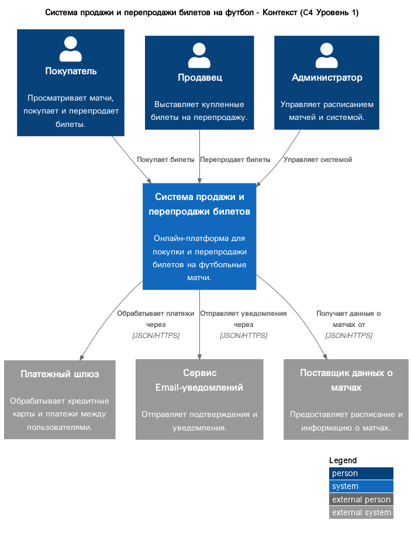

# Система продажи и перепродажи билетов на футбол

Этот проект содержит архитектурные артефакты для онлайн-платформы, которая позволяет пользователям покупать билеты на футбольные матчи напрямую от организаторов, а также перепродавать их друг другу.

## Описание архитектуры

Архитектура системы разработана с использованием **C4-модели** для визуализации на разных уровнях абстракции: контекст, контейнеры и компоненты.

- **Диаграмма контекста (Уровень 1):** Показывает, как система взаимодействует с пользователями (Покупатель, Продавец, Администратор) и внешними системами.
  

- **OpenAPI Спецификация:** Полное описание API доступно в файле [api-specification/openapi.yaml](api-specification/openapi.yaml).

## Структура проекта

- `README.md`: Этот файл.
- `generate_docs.sh`: Скрипт для автоматической генерации всех диаграмм.
- `docs/c4-diagrams/`: Директория, содержащая исходные `.puml` файлы и сгенерированные `.png` диаграммы.
- `api-specification/openapi.yaml`: Спецификация API в формате OpenAPI 3.0.
- `structurizr/model.dsl`: Описание архитектуры "как код" с использованием Structurizr DSL.

## Как сгенерировать диаграммы

Для генерации всех диаграмм из исходных `.puml` файлов, запустите скрипт:

```bash
sh generate_docs.sh
```

*Примечание: для работы скрипта требуется `plantuml.jar`, путь к которому указан внутри скрипта.*
